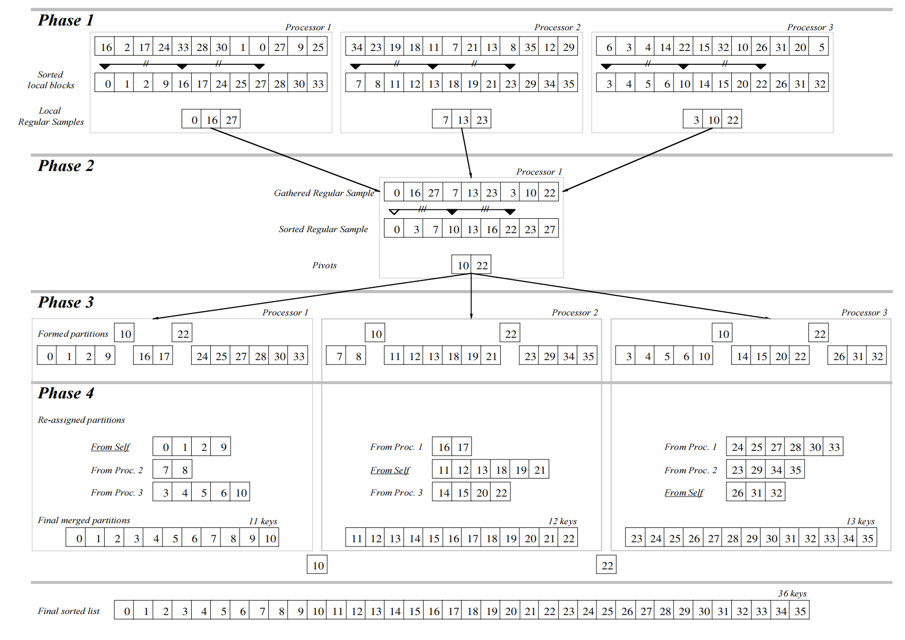

# MPI实现Parallel Sorting by Regular Sampling 实验报告
姓名：杨子旭  学号：21307130105 
## 1. 实验目的
- 用Message Passing Interface实现PSRS算法 
- 测量该算法在不同数组规模和进程数量下的用时
- 测量该算法在不同数组规模和进程数量下的加速比以衡量其性能
- 测量PSRS算法的四个阶段的用时情况

## 2. 实现思路

### 2.1 参数传递
为了便于测量该算法在不同数组规模和进程数量下的用时，以及测量PSRS算法的四个阶段的用时情况，我想让我的程序能够从命令行读取数组大小、是否分阶段输出计时这两个参数。进程数量可以由`MPI_Comm_size`获取，不需要额外的参数传递。
```cpp
      static const char *const OPT_STR = "l:o";
        static const struct option OPTS[] = {
                {"length",   required_argument, NULL, 'l'}, //数组长度
                {"outphase",   no_argument, NULL, 'o'}};    //是否输出各个阶段的用时
```
为了防止多个进程同时获取命令行参数引起混乱，我只让主进程获取参数，然后将整理好的参数广播到其余进程：
```cpp
/* arg 结构体中成员的值从根进程（排名为0的进程）
广播到 MPI 通信组中的所有其他进程。
这样，所有的进程都能获得相同的arg结构体中的值*/
static void argument_bcast(struct arguments *arg)
{
        MPI_Barrier(MPI_COMM_WORLD);
        MPI_Bcast(&(arg->length), 1, MPI_INT, 0, MPI_COMM_WORLD);
        MPI_Barrier(MPI_COMM_WORLD);
        MPI_Bcast(&(arg->procnum), 1, MPI_INT, 0, MPI_COMM_WORLD);
        MPI_Barrier(MPI_COMM_WORLD);
        MPI_Bcast(&(arg->outphase), 1, MPI_INT, 0, MPI_COMM_WORLD);
        MPI_Barrier(MPI_COMM_WORLD);
}
```
此后，由于进程间内存不共享，因此每个进程都有必要“记住”自己的和公有的全部参数。
```cpp
struct procargs { // 每个进程的参数
        unsigned int root; // 是否是根进程
        int id; // 进程的ID
        int procnum; // 本次运行的进程总数
        long *head; // 进程自己分到的数组的首地址
        int size; //进程自己分到的数组段大小
        int max_sample_size; // 最大采样大小
        int total_size;// 全局排序任务的数组大小
};
```

### 2.2 PSRS算法实现
下图简明生动地描述了Parallel Sorting by Regular Sampling的全过程，主要分为四个阶段：
1. 主进程均匀分割原数组为p份，发送给其他的进程，所有进程对分到的数组进行局部排序，按间隔$\frac{n}{p^2}$正则采样，将样本发送给主进程。
2. 主进程对收集到的样本进行排序，按间隔p对样本采样选取主元，然后把主元广播到各个进程内。
3. 所有进程根据主元来划分自己的数组。
4. 进程间相互交换划分后的数组块，然后各自进行归并排序。最后主进程依次收集到所有进程的排序结果，连在一起就是排序号的数组。

#### 2.2.1 数据结构设计与说明
由上面的流程图，PSRS算法需要用到的数据结构是**数组**。为了提升算法性能，我没有使用C++的 STL库`vector`来作为数组的数据结构，虽然`vector`可以自动管理内存，但是由于它每次超出已分配内存大小，都会先新分配一块2倍于原有大小的新空间，再把原有的数组复制过去，这导致了巨大的时间和空间开销的增长。所以我仅只用了`array`,每次存储时会根据大小手动用`calloc`函数分配内存，每次复制时用`memcpy`函数直接复制整块内存。为了便于获取array中元素的数量，我把元素数量和array首地址合并为一个结构体：`arr_segment`: 
```cpp
struct arr_segment { //一个数组段
        long *head; //首元素的地址
        int size; //数组段的长度
};
```
此外，由于每个进程会管理一个自己的数组序列，所以我为每个进程提供了一个结构体`segment_block`：
```cpp
struct segment_block { //每个进程管理自己的区块，区块内可能含有多个数组段
        bool clean; 
        int size; //有多少个数组段
        struct arr_segment part[]; //数组段的列表
};
```

#### 2.2.2 第一阶段 —— 均匀划分、局部排序、正则采样
1.  均匀划分
在`local_scatter`函数中，首先为每个进程分配了存储局部数据的空间 `arg->head`。接着，根进程通过 MPI 的 `MPI_Bcast` 函数向其他进程广播了每个进程应该接收的局部数据的大小 `arg->max_sample_size`。接下来，使用 MPI 的 `MPI_Scatter` 函数将原始数据 array 均匀划分给每个进程，每个进程接收到的数据存储在 `arg->head` 中。
```cpp
static void
local_scatter(long array[], struct procargs *const arg)
{
    // 为每个进程分配存储局部数据的空间
    arg->head = (long *)calloc(arg->size, sizeof(long)); 
    MPI_Barrier(MPI_COMM_WORLD); 
    // 由根进程广播每个进程应该接收的局部数据的大小
    MPI_Bcast(&(arg->max_sample_size), 1, MPI_INT, arg->procnum - 1, MPI_COMM_WORLD); 
    MPI_Barrier(MPI_COMM_WORLD);
    // 使用 MPI_Scatter 函数将原始数据均匀划分给每个进程
    MPI_Scatter(array, arg->size, MPI_LONG, arg->head, arg->size, MPI_LONG, 0, MPI_COMM_WORLD);
}
```
2.  局部排序和正则采样
`local_sort`函数负责在每个进程内对接收到的局部数据进行局部排序。首先，定义了一个采样步长 `window`，用于在排序后选择采样的数据点。然后，使用快速排序算法`qsort` 对局部数据 `arg->head` 进行排序。接着，通过链表 `local_sample_list` 存储采样结果，避免频繁的内存分配。最后，将链表中的采样点转移到 `local_samples` 结构中，其中包括采样点的大小和头指针。
```cpp
static void
local_sort(struct arr_segment *const local_samples, const struct procargs *const arg)
{
    // 采样步长，用于在排序后选择采样的数据点
    int window = arg->total_size / (arg->procnum * arg->procnum);
    List local_sample_list;
    memset(local_samples, 0, sizeof(struct arr_segment));
    // 在每个进程内使用快速排序进行局部排序
    qsort(arg->head, arg->size, sizeof(long), long_compare);
    // 使用链表存储采样结果
    for (int idx = 0, picked = 0; idx < arg->size && picked < arg->max_sample_size; idx += window, ++picked)
    {   // 将采样点添加到链表中
        local_sample_list.add(arg->head[idx]);
    }
    // 将采样结果转移到 local_samples 结构中
    local_samples->size = local_sample_list.getSize();
    local_samples->head = (long *)calloc(local_samples->size, sizeof(long));
    // 将链表中的数据拷贝到 local_samples
    long *array = new long[local_samples->size];
    local_sample_list.copyTo(array);
    memcpy(local_samples->head, array, local_samples->size * sizeof(long));
    delete[] array;
    MPI_Barrier(MPI_COMM_WORLD);
}
```
#### 2.2.3 第二阶段 —— 收集局部样本、排序后选取主元、广播主元
1. 收集局部样本
 `pivots_bcast` 函数通过 MPI 的 `MPI_Reduce` 函数，将每个进程的局部采样点数目 `local_samples->size` 汇总到根进程（rank 0）的 `total_samples.size` 中。 
    ```cpp
    // 使用MPI_Reduce将每个进程的局部采样点数目汇总到根进程的total_samples.size中
    MPI_Reduce(&(local_samples->size),
               &(total_samples.size),
               1,
               MPI_INT,
               MPI_SUM,
               0,
               MPI_COMM_WORLD);
    ```
    在根进程中，为 `total_samples.head` 分配足够的空间，并通过 MPI 的 `MPI_Gather` 函数，收集所有进程的局部采样点数据到 `total_samples.head` 中。 
    ```cpp
    // 使用MPI_Gather收集所有进程的局部采样点数据到total_samples.head中
    MPI_Gather(local_samples->head,
               local_samples->size,
               MPI_LONG,
               total_samples.head,
               local_samples->size,
               MPI_LONG,
               0,
               MPI_COMM_WORLD);
    ```
2. 排序样本点并选取主元
 接着，根据采样数据，根进程进行全局排序，选择每个进程所需的主元，即分割点。通过均匀选择的方式，选取了`arg->procnum` - 1 个主元，这保证了后续划分的块尽可能均匀。 
    ```cpp
        // 对total_samples.head进行全局排序
        qsort(total_samples.head,
              total_samples.size,
              sizeof(long),
              long_compare);
        // 从排序后的采样点中选取每个进程所需的主元
        for (int i = pivot_step, count = 0;
             i < total_samples.size && count < arg->procnum - 1;
             i += arg->procnum, ++count) {
            // 将选取的主元添加到pivot_list中
            if (0 > pivot_list.add(total_samples.head[i])) {
                MPI_Abort(MPI_COMM_WORLD, EXIT_FAILURE);
            }
        }
    ```
3. 广播主元 
   最后，通过 MPI 的 `MPI_Bcast` 函数将选取的主元广播给所有进程，每个进程根据收到的主元信息分配 pivots->head 空间，存储自己所需的主元数据。 
    ```cpp
    // 使用MPI_Bcast广播pivots->size到所有进程
    MPI_Bcast(&(pivots->size),
              1,
              MPI_INT,
              0,
              MPI_COMM_WORLD);
    // 如果不是根进程，为pivots->head分配空间
    if (arg->root == false) {
        pivots->head = (long *)calloc(pivots->size, sizeof(long));}

    // 使用MPI_Bcast广播pivots->head到所有进程
    MPI_Bcast(pivots->head,
              pivots->size,
              MPI_LONG,
              0,
              MPI_COMM_WORLD);
    ```
这个阶段的设计是为了确保每个进程都能获得相同的主元，并为下一阶段的划分做好准备。主元的均匀选择有助于保持后续划分的负载平衡。

#### 2.2.4 第三阶段 —— 所有进程根据主元来划分自己的数组、交换划分块 
1. 用主元来划分自己的数组
`arr_segment_form`函数让所有进程根据主元，用二分查找的方法找到“分割点”，然后形成自己的数组块。这里比较难考虑的是临界情况，比如两个分割点在同一个位置的情况。此时需要兼顾三种情况：此位置在首、中、尾。其中“首”和“中”的处理方法是将size置0，head(划分块中一个划分单元的首地址)保持在上一个划分单元的尾部。尾的处理方式较为特殊，因为如果此时继续用`binary search`，会导致数组访问越界，引发`segmentation fault`。因此我设置了侦察划分块是否已经满足数组大小的逻辑，一旦满足，就立刻退出，不再进行后面的查找。然后将退出点后面的划分单元的size全部置0.
```cpp
    // 初始划分块的头指针为数组的头指针
    blk->part[part_idx].head = arg->head;
    // 遍历选取的主元
    for (int pivot_idx = 0; pivot_idx < pivots->size; ++pivot_idx) {
        pivot = pivots->head[pivot_idx];
        // 通过二分查找获取当前主元在当前划分块中的位置
        if (0 > binary_search(&sub_idx,
                              pivot,
                              blk->part[part_idx].head,
                              arg->size - prev_part_size)) {
            MPI_Abort(MPI_COMM_WORLD, EXIT_FAILURE);
        }
        // 设置当前划分块的大小
        blk->part[part_idx].size = sub_idx;
        prev_part_size += sub_idx;
        // 如果当前划分块已满足数组大小，标记终止，并记录终止位置
        if(arg->size - prev_part_size == 0) {
            terminate = 1;
            terminate_from = part_idx + 1;
            break;
        }
        // 设置下一个划分块的头指针
        blk->part[part_idx + 1].head = blk->part[part_idx].head +
                                        blk->part[part_idx].size;
        ++part_idx;
    }
    // 如果终止标记为真，将后续划分块的头指针和大小置空
    if (terminate) {
        for(int i = terminate_from; i <= pivots->size; i++) {
            blk->part[i].head = NULL;
            blk->part[i].size = 0;
        }
    } else {
        // 如果没有终止，设置最后一个划分块的大小
        blk->part[part_idx].size = arg->size - prev_part_size;
    }
    free(pivots->head);
    MPI_Barrier(MPI_COMM_WORLD);
```
2. 交换划分块
   这里的发送和接收的逻辑都比较复杂。目标是让第k个进程收集其余进程的第k段划分块。
   方法是先遍历所有的进程，依次定义它们成为发送者
   ```cpp
           for (int i = 0; i < arg->procnum; ++i) {
                arr_segment_send(blk_copy, blk, i, &part_idx, arg);
        }
    ```
    接下来在`arr_segment_send`函数中，如果识别出是sender自己，就自己拷贝自己的第k段（k是进程自己的序号）。需要额外验证那一段是不是空的，如果第k段的size为0，则不拷贝。
    ```cpp
    /*如果是sender自己*/
        if (sid == arg->id) {
                blk_copy->part[*pindex].size = blk->part[arg->id].size;
                if(blk_copy->part[*pindex].size>0){
                blk_copy->part[*pindex].head = (long *)\
                                               calloc(blk->part[arg->id].size,
                                                      sizeof(long));

                memcpy(blk_copy->part[*pindex].head, blk->part[arg->id].head,
                       blk->part[arg->id].size * sizeof(long));}
                else blk_copy->part[*pindex].head = NULL;
                ++*pindex;
        }
    ```
    然后遍历自己的划分块，假设现在遍历到第j块。如果j与k（k是进程自己的序号）相等，就什么也不做。
    如果j与k不等，且自己是当前的sender，就依次发送自己的第j块给第j个进程；
    ```cpp
    if (sid == arg->id) {       //先发送大小信息
                                MPI_Ssend(&(blk->part[j].size),
                                          1,
                                          MPI_INT,
                                          j,
                                          0,
                                          MPI_COMM_WORLD);
                                if(blk->part[j].size!=0){
                                //把自己的第j块发送给第j个进程
                                MPI_Ssend(blk->part[j].head,
                                          blk->part[j].size,
                                          MPI_LONG,
                                          j,
                                          0,
                                          MPI_COMM_WORLD);}
                        }
    ```
    自己不是当前的sender，且当前遍历到的划分快正是自己想要的，就试图接收当前的sender（第j个进程）发送来的第k块。一共经过$p^2$轮循环，就可以实现让第k个进程都收集其余进程的第k段划分块。
    ```cpp
    else if (j == arg->id) {    //先接受大小信息
                                MPI_Recv(&(blk_copy->part[*pindex].size),
                                         1,
                                         MPI_INT,
                                         sid,
                                         MPI_ANY_TAG,
                                         MPI_COMM_WORLD,
                                         &recv_status);
                                mpi_recv_check(&recv_status,
                                               MPI_INT,
                                               1);
                                if(blk_copy->part[*pindex].size>0){ 
                                blk_copy->part[*pindex].head =(long *)calloc(\
                                                blk_copy->part[*pindex].size,
                                                sizeof(long)); //为要接受的数组分配空间
                                if (NULL == blk_copy->part[*pindex].head) {
                                        MPI_Abort(MPI_COMM_WORLD,
                                                  EXIT_FAILURE);
                                }
                                //接受第j个进程发来的第k块
                                MPI_Recv(blk_copy->part[*pindex].head,
                                         blk_copy->part[*pindex].size,
                                         MPI_LONG,
                                         sid,
                                         MPI_ANY_TAG,
                                         MPI_COMM_WORLD,
                                         &recv_status);
                                //核实是否顺利接收
                                mpi_recv_check(&recv_status,
                                               MPI_LONG,
                                               blk_copy->part[*pindex].size);}
    ```
#### 2.2.5 第四阶段 —— 归并排序

1. 归并排序
所有进程对自己的数组块进行多项归并排序。这里可以转化为多个二项归并排序：
    ```cpp
        running_result = blk_copy->part[0]; //初始结果
        for (int i = 1; i < arg->procnum; ++i) {
                merge_dump.size = running_result.size + blk_copy->part[i].size;
                if(blk_copy->part[i].size>0){ //对于size=0的块，直接忽略
                merge_dump.head = (long *)calloc(merge_dump.size, sizeof(long));
                //归并
                array_merge(merge_dump.head,
                            running_result.head,
                            running_result.size,
                            blk_copy->part[i].head,
                            blk_copy->part[i].size);
                running_result = merge_dump;}
        }
    ```
    然后把自己的结果存在一个数组列表的第k项中，k是自己的进程序号。
    ```cpp

        temp_result[arg->id].size = running_result.size;
        temp_result[arg->id].head = (long *)calloc(running_result.size, sizeof(long));
        memcpy(temp_result[arg->id].head, running_result.head,running_result.size*sizeof(long));
    ```
    最后所有进程把自己的第k项发送给主进程的相同位置
    ```cpp
    MPI_Recv(temp_result[i].head,
                                 merged_size,
                                 MPI_LONG,
                                 i,
                                 MPI_ANY_TAG,
                                 MPI_COMM_WORLD,
                                 &recv_status);
    ```
    主进程按顺序读取这个列表就可以得到排序的结果了
    ```cpp
    if(arg->root){
               int lastsize = 0;
                for(int i = 0; i < arg->procnum; i++){
                        memcpy((result->head + lastsize), temp_result[i].head, (temp_result[i].size) * sizeof(long));
                        lastsize += temp_result[i].size;
                        
                }
        }
    ```
## 3. 测试过程


### 3.1 测量时间的方法
在 `sort.cpp`的`parallel_sort` 函数中,对同一个实验进行了10次，取平均时间。
```cpp
        for (unsigned int i = 0; i < 10; ++i) { //运行十次，对时间取平均数
                psort_wrapper(per_phase_sort_time, arg);           
                for (int j = 0; j < PHASE_COUNT; ++j) {
                        avg_per_phase_sort_time[j] += (per_phase_sort_time[j]/10); //每个phase的运行时间
                        total_sort_time += (per_phase_sort_time[j]/10); //总运行时间
                }       
                MPI_Barrier(MPI_COMM_WORLD); 
        }
```
为了测量每个phase的用时，我在两个phase之间让主进程来计时。
```cpp
        if (arg->root) {
                timing_stop((elapsed[PHASE1]), start);
                timing_reset(start);
                timing_start(start);
        }
```
如果用户指定分phase输出，就输出四个数。如果输出整个的排序用时，就求和再输出。
```cpp
        if (arg->outphase) { //如果要分段输出
                for (int j = 0; j < PHASE_COUNT; ++j) {
                                psort_stats[j] += per_phase_sort_time[j];
                        }
        } else { //如果要输出整块的时间
                psort_stats[0] = total_sort_time;
        }
```
### 3.2 自动化测量方法
为了测试并行排序算法在不同的数据规模、不同的线程数下的表现，相比串行排序的加速比等等，我编写了一个python程序`run.py`，它能够用不同的参数组合运行可执行文件，然后将得到的数据（时间）整合存储到一个csv文件，以便后续数据可视化的处理。
参数设定：
```py
    program_path = "./executable/psrs"
    mpi_run = "mpirun -np {procnum} "
    len_flag = " -l {length}"
    program = mpi_run + program_path + len_flag

    procnum_range = tuple(2**e for e in range(4))
    size_range = tuple(2**e for e in range(16, 20, 1))
```

### 3.3 数组生成和排序正确性验证
为了避免特定的数组元素排列导致排序时间受影响，我让每次运行并行算法函数都随机生成一个数组。并且在排序完成后验证排序后的数组是不是顺序的。数组由时间种子随机生成，验证排序正确性由主进程在最后完成：
```cpp
              /*验证排序结果是否正确*/
                long *cmp = (long *)calloc(arg->total_size, sizeof(long));
                memcpy(cmp, result.head, arg->total_size * sizeof(long));
                qsort(cmp, arg->total_size, sizeof(long), long_compare);
                if(memcmp(cmp, result.head, arg->total_size * sizeof(long))!=0){
                       puts("The Result is Wrong!");//如果不正确，会中止程序
                       MPI_Abort(MPI_COMM_WORLD, EXIT_FAILURE); 
                }
```

### 3.4 测试程序运行方法和结果
为了便于测试时编译运行PSRS项目，我编写了`CMakelist.txt`和`build.sh`，只需要在终端输入`./build.sh` 就可以自动编译、链接MPI库。正确运行的结果是在`executable`的目录下生成一个名为`psrs`的可执行文件。
然后运行`run.py`，就可以在data目录下得到全部的实验数据，以csv格式存储。


## 4. 实验结果（含可视化与分析）
为了便于可视化调试，我使用了jupyter notebook，利用python的可视化库`matplotlib`来绘制图表，绘图的python程序在`visualize`目录下，绘图的结果以png图片格式存在`visualize/plots`内。
### 4.1 算法用时与数据规模和线程数的关系
根据运行结果的csv文件，我绘出了这张3D柱状图，它描述了运行时间与线程数量、数组规模的关系： 

 

图中的X，Y轴分别是进程数量、数组大小，纵轴是用时。时间越短，排序速度越快。
#### 4.1.1 算法用时与数据规模的关系

随着数据规模的增大，排序用时都有不同程度的增加。 

- 串行排序用时和数据规模几乎是正比增长的关系。（注意这里array size是指数级增长）
- 进程数量越多，用时增长随数组规模增大就越慢。进程数为8时，随着数据规模的指数级增长，用时只呈现了线性增长的趋势，体现了并行算法的优势。

#### 4.1.2 算法用时与线程数量的关系
随着进程的增多，排序用时呈现下降趋势。

- 算法用时的减少随着进程数的增加变慢了。2个进程比1个进程几乎快了一倍，但是8个进程比4个进程的提升很有限。
- 我分析可能是因为通信和同步开销。在并行执行中，不同进程之间需要进行通信和同步，以确保正确的执行顺序和一致性。这些操作引入开销，会成为性能的瓶颈。


### 4.2 加速比与数据规模和线程数量的关系
为了更好的可视化效果，我选择了比较折中的数组规模变化粒度，测量并行排序时间：
| array size | Processors: 1 | Processors: 2 | Processors: 4 | Processors: 8 |
|---------|---------------|---------------|---------------|---------------|
| \(2^{14}\) | 0.001430      | 0.000788      | 0.000684      | 0.000622      |
| \(2^{16}\) | 0.006444      | 0.003581      | 0.002201      | 0.002025      |
| \(2^{18}\) | 0.029598      | 0.016107      | 0.010607      | 0.008047      |
| \(2^{20}\) | 0.129195      | 0.072732      | 0.046763      | 0.031719      |
| \(2^{22}\) | 0.584864      | 0.327956      | 0.199234      | 0.136412      |

用串行排序时间除以上面的数据，就得到了加速比：
| \(2^n\) | Speedup (2) | Speedup (4) | Speedup (8) |
|---------|-------------|-------------|-------------|
| \(2^{14}\) | 1.814721    | 2.090643    | 2.299035    |
| \(2^{16}\) | 1.799497    | 2.927760    | 3.182222    |
| \(2^{18}\) | 1.837586    | 2.790421    | 3.678141    |
| \(2^{20}\) | 1.776316    | 2.762761    | 4.073111    |
| \(2^{22}\) | 1.783361    | 2.935563    | 4.287482    |


这张折线图描述了在不同的数组规模下，加速比与进程数量的关系： 

 
- 总体来看，进程越多，数组规模越大，加速比越高。
- 随着进程数增加，加速比的增长会放缓。因为随着进程数增多，通信和同步开销会增长。
- 对于较小的数组规模，进程数设置为4是最好的权衡之选，拥有较高的加速比。如果继续增多进程，加速比增长会变得很不明显。
- 对于较大的数组规模，进程数可以适当设置得大一些。因为大规模数组可以让并行算法的优势超过它的劣势。

### 4.3 PSRS各个阶段的用时
下面的簇状柱状图反映了PSRS算法的各个时段的用时。（固定process number = 8）

- 第一阶段（均匀划分、局部排序、正则采样）用时最多，而且增长最快。
- 第二阶段（选取主元并广播）用时几乎可以忽略。
- 第三阶段（划分数组、交换数组块）用时随着数组增长的变化不明显。可能是因为通信的开销占主导。
- 第四阶段（归并排序）用时随着数组大小的增长而增长，且增速与第一阶段差不多。

综合下来，局部排序和归并排序的过程的时间开销是最大的。


## 5. 结论与展望
- 并行算法的性能受到多方面因素的影响，包括数据规模、线程数量、任务划分、同步和通信开销等。
- MPI提供了灵活的并行编程框架，但需要合理设计算法并注意性能瓶颈，以充分发挥并行计算的优势。
- PSRS算法是MPI编程的一个简单应用，未来可以进一步优化算法，尝试其他并行计算框架，如CUDA，以提高排序算法的性能。